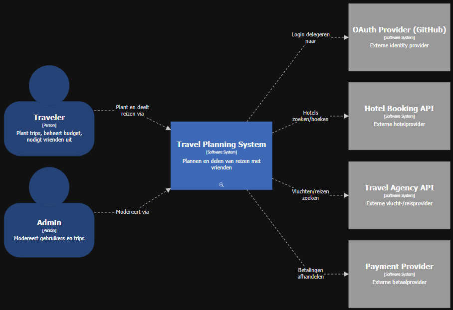
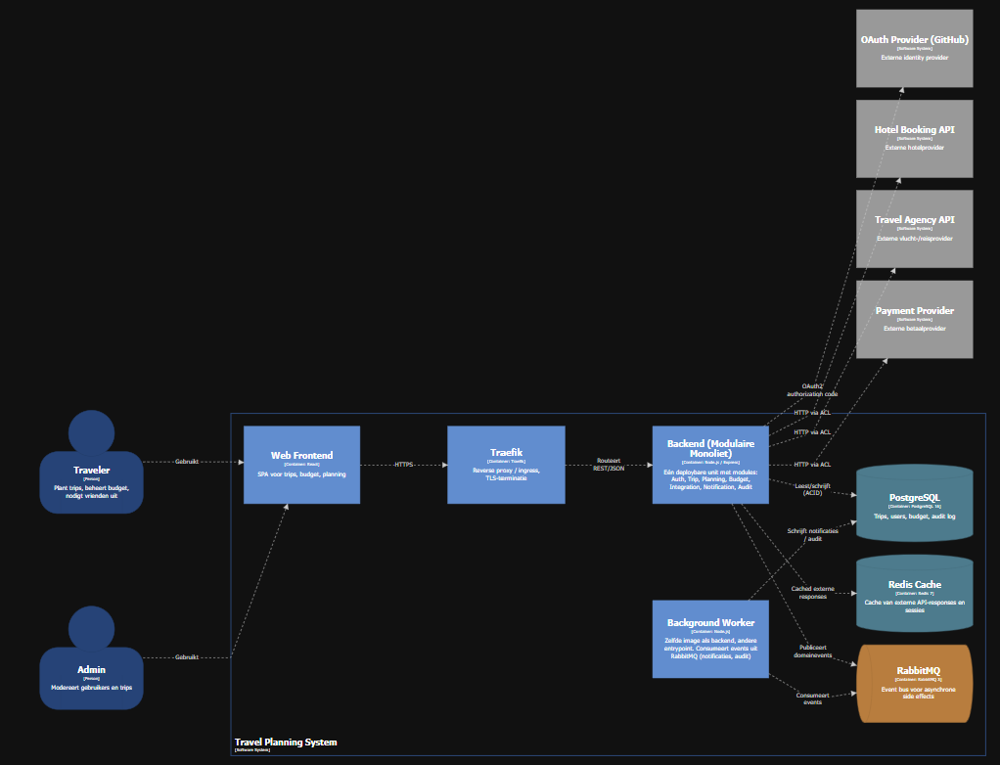
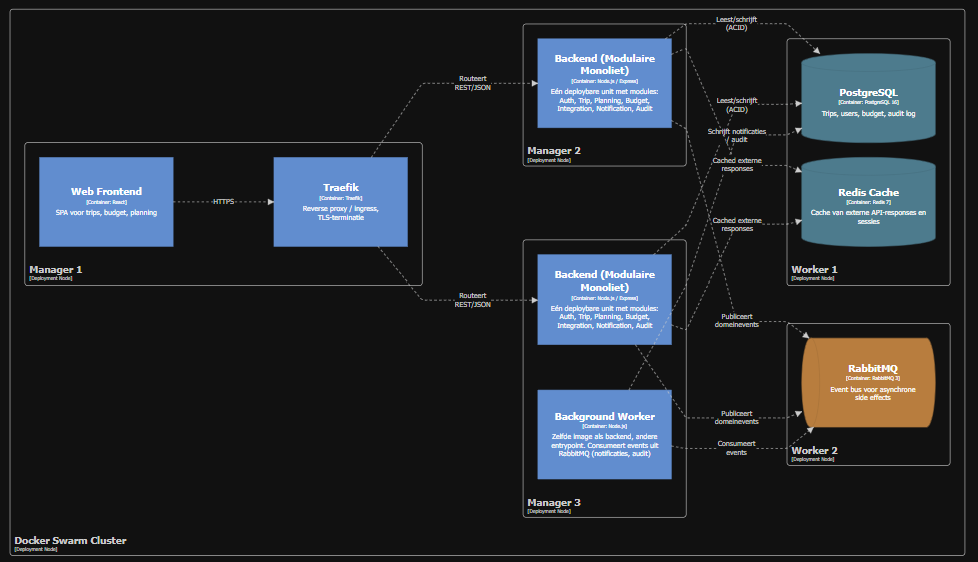

# Eindopdracht ICT Architecture — Travel Planning App

AP Hogeschool, 2e jaar Toegepaste Informatica.

**Case:** platform voor het plannen en delen van reizen met vrienden, met gedeeld budgetbeheer, activiteitenplanning en integraties met externe diensten (hotels, vluchten, payment providers).

**Team:** 5 leden.

---

## Inhoudsopgave

1. [Karakteristieken](#1-karakteristieken)
2. [Logische componenten](#2-logische-componenten)
3. [ADR-001 — Architecturale stijl](#3-adr-001--architecturale-stijl)
4. [Verdere ADR's](#4-verdere-adrs)
5. [C4-diagrammen](#5-c4-diagrammen)
6. [Proofs of Concept](#6-proofs-of-concept)

---

## 1. Karakteristieken

Top 7 quality attributes voor de applicatie.

### 1.1 Availability

Gebruikers bevinden zich in verschillende tijdzones en kunnen op elk moment toegang nodig hebben tot hun reisplanning, boekingen en budgetinformatie. Ook tijdens de reis zelf moet de applicatie betrouwbaar beschikbaar blijven, bijvoorbeeld om reservaties te raadplegen of wijzigingen door te voeren. Daarom moet het systeem ontworpen worden met minimale downtime en een hoge beschikbaarheid.

### 1.2 Confidentiality

De applicatie verwerkt gevoelige gegevens zoals persoonlijke informatie, reisdata, locaties en mogelijk betalingsgegevens. Deze informatie mag enkel toegankelijk zijn voor bevoegde gebruikers. Ongeautoriseerde toegang kan leiden tot privacyproblemen, misbruik of veiligheidsrisico's. Daarom moet het systeem vertrouwelijkheid garanderen via sterke authenticatie, toegangscontrole en versleuteling.

### 1.3 Interoperability

De applicatie integreert externe diensten van reisbureaus, hotels, vluchtenplatformen en andere aanbieders. Deze externe partijen gebruiken elk hun eigen API's, dataformaten en protocollen. Het systeem moet in staat zijn om vlot te communiceren met deze heterogene diensten, en moet ook nieuwe integraties kunnen toevoegen zonder de kern van de applicatie te hertekenen.

### 1.4 Fault Tolerance

Externe diensten zoals hotel-API's of vluchtdatabanken kunnen tijdelijk onbeschikbaar zijn. De applicatie mag hierdoor niet volledig uitvallen. Componenten moeten onafhankelijk van elkaar falen, en het systeem moet gracieus degraderen — bijvoorbeeld door gecachte data te tonen of de gebruiker te informeren zonder verlies van reeds ingevoerde planningsdata.

### 1.5 Latency

Gebruikers zoeken gelijktijdig door grote hoeveelheden activiteiten, hotels en vluchten. Trage zoekresultaten leiden rechtstreeks tot frustratie en verlaten sessies. Zeker op mobiele apparaten of bij beperkte dataverbinding tijdens een reis is een lage responstijd cruciaal voor een goede gebruikerservaring.

### 1.6 Data Consistency

Meerdere vrienden werken gelijktijdig aan hetzelfde reisplan en budget. Conflicterende wijzigingen moeten correct afgehandeld worden. Dit is een echte architecturale uitdaging die keuzes beïnvloedt tussen eventual consistency en strong consistency, met directe impact op gebruikerservaring en data-integriteit.

### 1.7 Scalability

De applicatie heeft duidelijke gebruikspieken (vakantieperiodes). Dit heeft een directe impact op architecturale keuzes zoals horizontale schaalbaarheid, load balancing en elastische infrastructuur. Het systeem moet pieken kunnen opvangen zonder degradatie van beschikbaarheid of latency.

---

## 2. Logische componenten

Bepaald via actor-action / workflow approach — vóór de keuze van een architecturale stijl.

### 2.1 Actoren

| Actor | Rol |
|---|---|
| Traveler | Eindgebruiker die deelneemt aan een trip |
| Trip-owner | Traveler die de trip aanmaakt en beheert |
| Admin | Beheerder van het platform |
| Externe provider | Hotel-, vlucht- of payment-API (passieve actor) |
| Background scheduler | Tijdgestuurde trigger (passieve actor) |

### 2.2 Actor-Action tabel

| Actor | Actie | Component(en) |
|---|---|---|
| Traveler | Registreren / inloggen via externe provider | User & Auth |
| Traveler | Eigen profiel beheren | User & Auth |
| Trip-owner | Trip aanmaken, bewerken, verwijderen | Trip Management |
| Trip-owner | Vrienden uitnodigen voor trip | Trip Management → Notification |
| Traveler | Uitnodiging accepteren of weigeren | Trip Management |
| Traveler | Activiteit toevoegen aan trip | Trip Management, Planning & Route |
| Traveler | Route plannen tussen bestemmingen | Planning & Route, Integration Layer |
| Traveler | Hotels en vluchten zoeken | Integration Layer (externe API's) |
| Traveler | Boeking importeren | Integration Layer, Trip Management |
| Traveler | Uitgave registreren | Budget & Payment |
| Traveler | Budget splitsen tussen deelnemers | Budget & Payment |
| Traveler | Settle-up bekijken en bevestigen | Budget & Payment |
| Traveler | Notificaties ontvangen (push, email, in-app) | Notification |
| Externe provider | Beschikbaarheid en prijzen leveren | Integration Layer |
| Externe provider | Boeking bevestigen | Integration Layer |
| Background scheduler | Herinneringen versturen (vertrek nadert) | Notification, Trip Management |
| Background scheduler | Externe data herverversen (cache) | Integration Layer |
| Admin | Gebruikers en trips modereren | User & Auth, Trip Management |
| Admin | Audit logs raadplegen | Audit & Activity Log |

### 2.3 Componenten en taken

| # | Component | Verantwoordelijkheid |
|---|---|---|
| 1 | User & Auth | Identiteit, registratie, login via externe OAuth-provider, JWT-uitgifte, rollen, sessies |
| 2 | Trip Management | CRUD trips, deelnemers, uitnodigingen, versiebeheer van het reisplan |
| 3 | Planning & Route | Activiteiten plannen, routes berekenen, ETA's, multi-stop ordering |
| 4 | Budget & Payment | Uitgaven registreren, split-logica, settle-up berekening, transacties |
| 5 | Integration Layer (Anti-Corruption Layer) | Adapters naar externe API's (hotels, vluchten, payments), normalisatie, caching, retry |
| 6 | Notification | Push, email, in-app notificaties; event-driven triggers |
| 7 | Audit & Activity Log | Centraal vastleggen van wijzigingen en gevoelige acties |

### 2.4 Cross-cutting concerns

- API Gateway / BFF — entry point, routing, auth-validatie
- Caching Layer (Redis) — hot data versnellen, externe responses bufferen
- Background Jobs / Scheduler — periodieke triggers, outbox-publisher
- Reporting & Analytics — afgeleide statistieken
- Admin / Backoffice — moderatie-tooling

Deze componenten zijn logisch, niet fysiek. De mapping naar deploybare units (modules in een modulaire monoliet, of services bij microservices) gebeurt in ADR-001.

---

## 3. ADR-001 — Architecturale stijl

Status: Accepted. Formaat: [MADR 3.0](https://adr.github.io/madr/). Lokale template: [`docs/adr/template.md`](docs/adr/template.md). Volledige ADR: [`docs/adr/ADR-001-architecture-style.md`](docs/adr/ADR-001-architecture-style.md).

### 3.1 Beslissing

We kiezen voor een **modulaire monoliet** in Node.js. Eén deploybare backend, met de modules uit hoofdstuk 2 (User & Auth, Trip, Budget, Planning, Integration, Notification, Audit) als interne pakketten. Module-grenzen worden bewaakt via boundary-tests in CI.

De tweede keuze is **microservices met event-driven communicatie**. Conceptueel sluit die stijl beter aan bij Scalability en Fault Tolerance, maar de operationele overhead (service mesh, distributed tracing, eventual consistency over services) past niet binnen een team van vijf en een MVP van zes maanden.

### 3.2 Waarom modulaire monoliet

De doorslag ligt bij Data Consistency en time-to-market. Gedeeld budget tussen vrienden vereist ACID-transacties; eventual consistency over services maakt settle-up onnodig complex. Eén database, één deploybare unit, geen netwerklatency tussen modules. Pakketgrenzen leveren wel de discipline om later — indien nodig — modules af te splitsen naar services.

### 3.3 Overwogen stijlen

Alle stijlen uit de cursus zijn overwogen: klassieke monoliet, layered, modulaire monoliet, microservices, event-driven, space-based, microkernel, SOA, pipeline en serverless. De volledige pro/con-analyse per stijl staat in het ADR-bestand. De korte versie:

- **Klassieke monoliet** en **layered** lossen het grens-probleem niet op.
- **Space-based**, **microkernel** en **pipeline** passen niet bij een interactieve, transactionele applicatie.
- **SOA** komt neer op een zwaardere variant van microservices.
- **Serverless** botst met de opgelegde Docker Swarm-deployment.
- **Event-driven** wordt niet als hoofdstijl gekozen, maar wel ingezet voor asynchrone side effects (zie ADR-005).

### 3.4 Gevolgen

Sterke kanten: snel ontwikkelpad, ACID out-of-the-box, één artifact om te deployen en monitoren, en een duidelijk migratiepad naar microservices later. Zwakke kanten: de hele applicatie schaalt als geheel mee (gemitigeerd via meerdere replicas op Swarm), één falende module kan de hele app raken, en de module-grenzen vragen actieve bewaking — anders glijdt de codebase richting een ongestructureerde monoliet.

---

## 4. Verdere ADR's

Vijf bijkomende ADR's voor de belangrijkste beslissingen. Volledige inhoud per ADR in `docs/adr/`.

| ADR | Onderwerp | Status | Gekoppelde POC |
|---|---|---|---|
| [ADR-002](docs/adr/ADR-002-caching.md) | Caching van externe reisgegevens (Redis) | Accepted | POC 2 |
| [ADR-003](docs/adr/ADR-003-authentication.md) | Authenticatie (OAuth2 + eigen JWT) | Accepted | POC 1 |
| [ADR-004](docs/adr/ADR-004-database.md) | Database en concurrency-strategie (PostgreSQL) | Accepted | POC 4 |
| [ADR-005](docs/adr/ADR-005-messaging-system.md) | Messaging binnen modulaire monoliet (RabbitMQ) | Accepted | POC 3 |
| [ADR-006](docs/adr/ADR-006-externe-integratie.md) | Externe integratie (adapter + circuit breaker) | Accepted | POC 5 |

---

## 5. C4-diagrammen

Modellering volgens het C4-model met Structurizr DSL. De DSL-broncode staat hieronder; de gerenderde views staan onder `docs/images/`.

### 5.1 System Context



### 5.2 Container



### 5.3 Deployment



### 5.4 Structurizr DSL

Volledige DSL: [`docs/c4_diagrammen/structure.dsl`](docs/c4_diagrammen/structure.dsl).

```dsl
workspace "Travel Planning App" "ICT Architecture Assignment" {

    model {
        # Actors
        traveler = person "Traveler" "Plant trips, beheert budget, nodigt vrienden uit"
        admin    = person "Admin" "Modereert gebruikers en trips"

        # Externe systemen
        oauthProvider   = softwareSystem "OAuth Provider (GitHub)" "Externe identity provider" "External System"
        hotelApi        = softwareSystem "Hotel Booking API"       "Externe hotelprovider"     "External System"
        travelAgency    = softwareSystem "Travel Agency API"       "Externe vlucht-/reisprovider" "External System"
        paymentProvider = softwareSystem "Payment Provider"        "Externe betaalprovider"    "External System"

        # Eigen systeem — modulaire monoliet (ADR-001)
        travelApp = softwareSystem "Travel Planning System" "Plannen en delen van reizen met vrienden" {
            webApp   = container "Web Frontend" "SPA voor trips, budget, planning" "React"
            traefik  = container "Traefik" "Reverse proxy / ingress, TLS-terminatie" "Traefik"
            backend  = container "Backend (Modulaire Monoliet)" "Eén deploybare unit met modules: Auth, Trip, Planning, Budget, Integration, Notification, Audit" "Node.js / Express"
            worker   = container "Background Worker" "Zelfde image als backend, andere entrypoint. Consumeert events uit RabbitMQ (notificaties, audit)" "Node.js"
            postgres = container "PostgreSQL"   "Trips, users, budget, audit log" "PostgreSQL 16" "Database"
            redis    = container "Redis Cache"  "Cache van externe API-responses en sessies" "Redis 7"   "Database"
            rabbit   = container "RabbitMQ"     "Event bus voor asynchrone side effects" "RabbitMQ 3"   "Messaging"
        }

        # System context
        traveler  -> travelApp "Plant en deelt reizen via"
        admin     -> travelApp "Modereert via"
        travelApp -> oauthProvider   "Login delegeren naar"
        travelApp -> hotelApi        "Hotels zoeken/boeken"
        travelApp -> travelAgency    "Vluchten/reizen zoeken"
        travelApp -> paymentProvider "Betalingen afhandelen"

        # Container relaties
        traveler -> webApp  "Gebruikt"
        admin    -> webApp  "Gebruikt"
        webApp   -> traefik "HTTPS"
        traefik  -> backend "Routeert REST/JSON"
        backend  -> postgres "Leest/schrijft (ACID)"
        backend  -> redis    "Cached externe responses"
        backend  -> rabbit   "Publiceert domeinevents"
        worker   -> rabbit   "Consumeert events"
        worker   -> postgres "Schrijft notificaties / audit"

        # Externe integraties op container-niveau
        backend -> oauthProvider   "OAuth2 authorization code"
        backend -> hotelApi        "HTTP via ACL"
        backend -> travelAgency    "HTTP via ACL"
        backend -> paymentProvider "HTTP via ACL"

        # Deployment — testcluster: 3 managers + 2 workers
        deploymentEnvironment "Production" {
            deploymentNode "Docker Swarm Cluster" "3 managers, 2 workers" {
                deploymentNode "Manager 1" "Linux VM — ingress" {
                    containerInstance traefik
                    containerInstance webApp
                }
                deploymentNode "Manager 2" "Linux VM" {
                    containerInstance backend
                }
                deploymentNode "Manager 3" "Linux VM" {
                    containerInstance backend
                    containerInstance worker
                }
                deploymentNode "Worker 1" "Linux VM — stateful data" {
                    containerInstance postgres
                    containerInstance redis
                }
                deploymentNode "Worker 2" "Linux VM — messaging" {
                    containerInstance rabbit
                }
            }
        }
    }

    views {
        systemContext travelApp "SystemContext" {
            include *
            autoLayout
        }

        container travelApp "Containers" {
            include *
            autoLayout
        }

        deployment travelApp "Production" "Deployment" {
            include *
            autoLayout
        }

        styles {
            element "Person" {
                shape Person
                background #08427B
                color #ffffff
            }
            element "Software System" {
                background #1168BD
                color #ffffff
            }
            element "External System" {
                background #999999
                color #ffffff
            }
            element "Container" {
                background #438DD5
                color #ffffff
            }
            element "Database" {
                shape Cylinder
                background #2E7C8F
                color #ffffff
            }
            element "Messaging" {
                shape Pipe
                background #C97A2E
                color #ffffff
            }
        }
    }
}
```

---

## 6. Proofs of Concept

Vijf POC's, één per teamlid. Elke POC is een aparte directory met eigen `README.md`. Opstartcommando vanuit de POC-directory:

```bash
docker stack deploy -c poc.yaml poc
```

(Uitzondering: zie de README per POC indien een afwijkende start vereist is.)

| POC | Onderwerp | Quality attribute(s) | Directory |
|---|---|---|---|
| 1 | OAuth login + eigen JWT (GitHub) | Confidentiality | [`poc/poc-1/`](poc/poc-1/) |
| 2 | Redis caching van reisgegevens | Performance, Availability, Resilience | [`poc/poc-2/`](poc/poc-2/) |
| 3 | RabbitMQ messaging binnen modulaire monoliet | Fault Tolerance, Loose Coupling, Scalability | [`poc/poc-3/`](poc/poc-3/) |
| 4 | PostgreSQL concurrent budget updates (FOR UPDATE) | Data Consistency, Fault Tolerance | [`poc/poc-4/`](poc/poc-4/) |
| 5 | Integration Layer — adapter + circuit breaker (mock hotel API) | Interoperability, Fault Tolerance | [`poc/poc-5/`](poc/poc-5/) |
