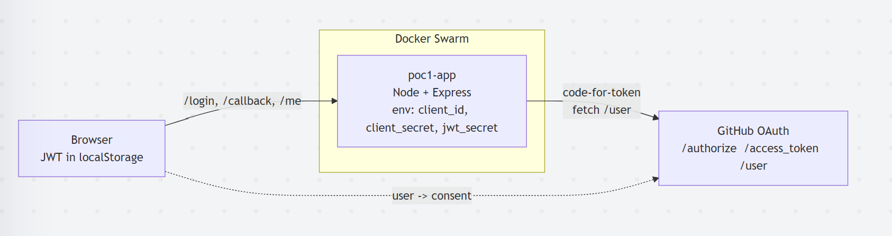
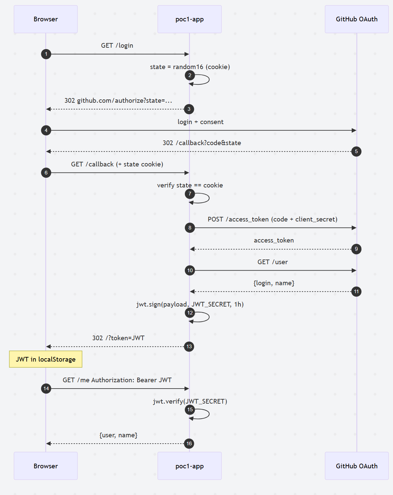

# POC 1 - OAuth login + eigen JWT

## Doel

User logt in via externe OAuth-provider (GitHub). Backend ontvangt authorization code, wisselt om voor access token, haalt user-info op, en geeft een eigen JWT terug aan de client. De app beheert zelf geen passwords.

Quality attribute: **Confidentiality** (delegatie van authenticatie aan vertrouwde provider, geen wachtwoorden in de app).

## Architectuur

Browser → backend (Express) → GitHub OAuth. Backend signt een eigen JWT na succesvolle code-exchange en stuurt het terug naar de client.



## Flow

Authorization Code flow: login-redirect, consent bij GitHub, callback met `code`, server-side token-exchange, user-info ophalen, eigen JWT teruggeven, daarna `Bearer`-calls naar `/me`.



## OAuth provider

GitHub OAuth (Authorization Code flow). Snelste setup, geen verification nodig voor POC.
Productie-richting: zelfde flow met Google of self-hosted IdP, alleen endpoints wisselen.

## Run

Vul eerst `app/.env` in:

```bash
cp app/.env.example app/.env   # zet GITHUB_CLIENT_ID en _SECRET
```

Bouw image en deploy op Docker Swarm:

```bash
docker build -t poc1-app:latest ./app
docker stack deploy -c poc.yaml poc
```

De stack leest `app/.env` rechtstreeks via `env_file`.

Optioneel handig op Windows: `.\deploy.ps1` doet beide stappen (en init swarm indien nodig).

Open http://localhost:8080.

## Demo

1. Klik **Login with GitHub** → redirect naar GitHub → consent.
2. GitHub redirect terug naar `/callback?code=...`.
3. Backend wisselt code in voor access token, haalt user-info, signt eigen JWT.
4. Browser ontvangt JWT, slaat op in `localStorage`.
5. Klik **Call /me** → request met `Authorization: Bearer <JWT>` → response `{user, name}`.

```bash
# CLI variant
curl http://localhost:8080/me -H "Authorization: Bearer <JWT>"
```

## Resultaat

Gebruiker authenticeert via externe provider. De app slaat geen wachtwoorden op en gebruikt enkel een eigen JWT als sessie-token.

## Cleanup

```bash
docker stack rm poc
```
